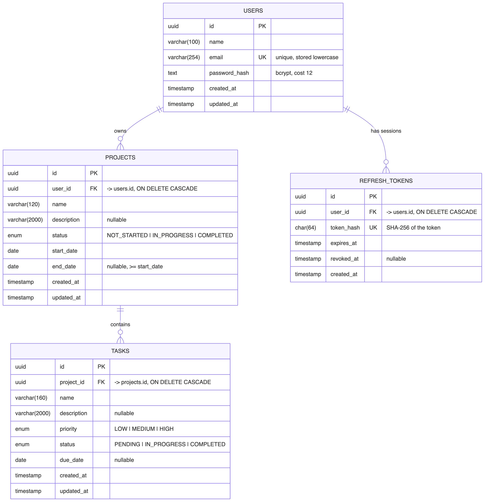
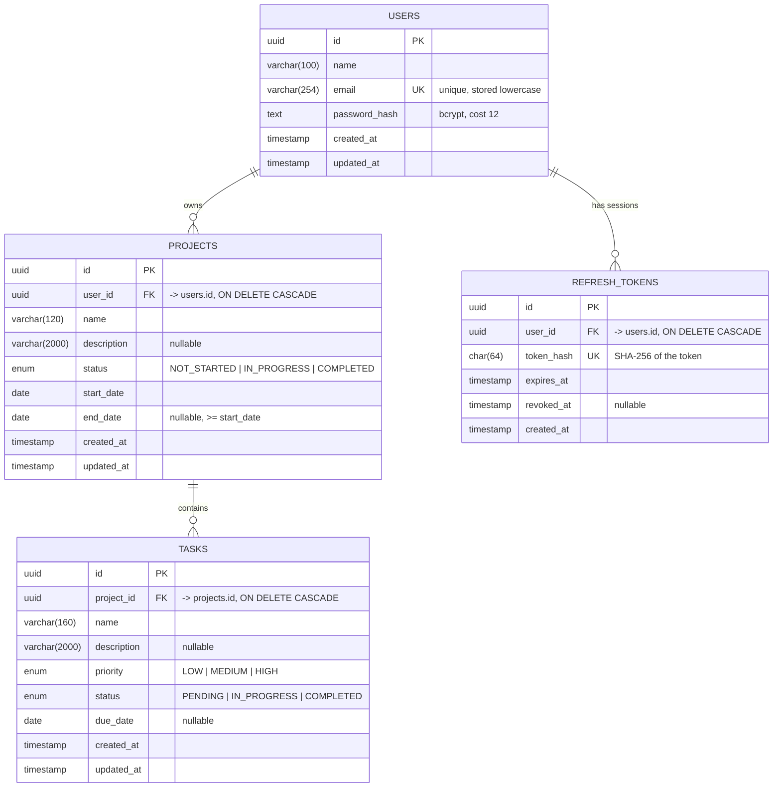

# Database schema (ER diagram)

PostgreSQL, managed with Prisma (`apps/api/prisma/schema.prisma`). Migrations live in
`apps/api/prisma/migrations`.

## Design notes

- **Normalized ownership chain.** `users 1─N projects 1─N tasks`. Tasks have no `user_id`;
  a task's owner is always resolved through its project. That avoids duplicated data that
  could drift out of sync, and every ownership check is a join on `projects.user_id`.
- **Foreign keys with cascades.** Deleting a project deletes its tasks; deleting a user
  deletes their projects, tasks and sessions. No orphaned rows.
- **Enums in the database.** Status and priority are PostgreSQL enums, so invalid values
  are rejected by the database as well as by request validation.
- **Calendar dates as `date`.** Start, end and due dates have no time component, so they
  can't shift across time zones.
- **Indexes match the queries:** `projects(user_id, status)`, `projects(user_id, created_at)`,
  `tasks(project_id, status)`, `tasks(project_id, priority)`, `refresh_tokens(user_id)`,
  plus the unique indexes on `users.email` and `refresh_tokens.token_hash`.
- **Refresh tokens are stored hashed.** Only the SHA-256 hash is kept, so a database leak
  doesn't expose usable sessions. `revoked_at` supports logout, rotation and reuse detection.
